## c/c++ build a simple b+tree RDMS（利用c/c++ 开发基于B+树的小型关系型数据库 ）

开发环境：ubuntu

1. 输入`make`进行编译，输入`./duck_db`即可运行；
2. `make clean`清除文件。

[TOC]

#### 目的

> “What I cannot create, I do not understand.” – [Richard Feynman](https://en.m.wikiquote.org/wiki/Richard_Feynman)

正如这句名言，理解一个事物最好的办法就是亲自设计制作它，本文将介绍一个简单的关系型数据库系统（类似MySQL、sqlite等）的开发过程，用于理解关系型数据库基本工作原理，我称它为duck_db。

帮助界面：

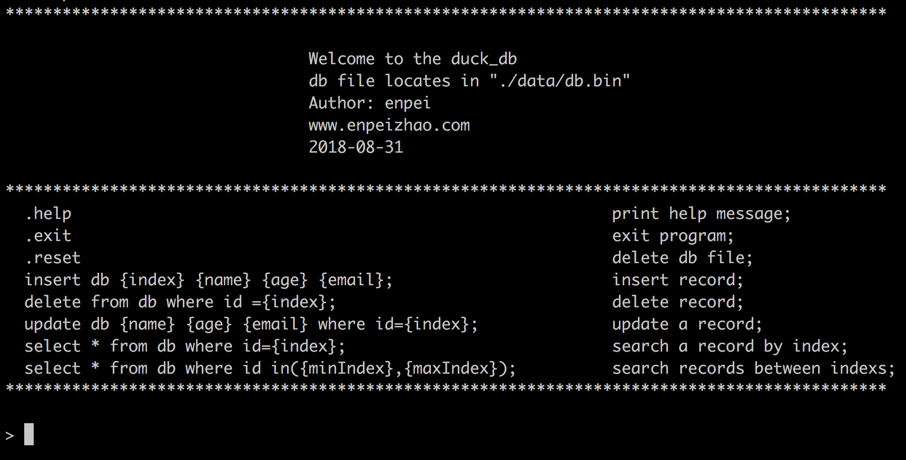

主要功能特色如下：

1. 使用C/C++开发；
2. 已实现基本的CURD操作，使用控制台SQL：
   1. 新建记录（create），操作SQL：**insert db {index} {name} {age} {email};**
   2. 更新记录（update），操作语句：**update db {name} {age} {email} where id={index};**
   3. 单条读取记录（read），操作语句：**select * from db where id={index};**
   4. 范围读取（read in range），操作语句：**select * from db where id in({minIndex},{maxIndex});**
   5. 删除记录（delete），操作语句：**delete from db where id ={index};**
3. 底层使用B+树（B+ TREE）构建索引；
4. 利用二进制存储数据表；
5. 暂不支持自定义表结构，数据库表结构固定为：id，name，age，email，如图：

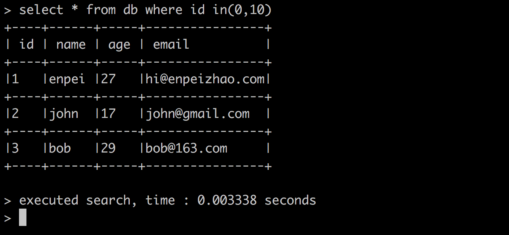

#### 过程

下图是sqlite的架构图：


参考上图，主要开发步骤如下：

1. 创建一个控制台对话交互程序（REPL：read-execute-print loop）；
2. 创建一个简单的词法分析器用来解析SQL语句；
3. 编写CURD函数实现数据库的增删改查操作；
4. 创建一个b+树索引引擎，进行数据库的索引和磁盘读写操作，数据表将以二进制的形式存储。

##### Step 1：REPL（read-execute-print loop）

使用一个字符数组（*userCommand）接受用户输入，并且不断比对关键字，用于识别SQL语句指令：

代码片段：

```c++
// REPL
void selectCommand(){
char *userCommand = new char[256];
while(true){
	// 获取用户输入
	cin.getline(userCommand,256);
	if(strcmp(userCommand,".exit") == 0){
		// 退出系统
		break;
    }else if(strcmp(userCommand,".help") == 0){
    	// 帮助
    }else if(strcmp(userCommand,".reset") == 0){
    	// 重置数据库
    }else if(strncmp(userCommand,"insert",6) == 0){
    	// 插入记录
    }else if(strncmp(userCommand,"delete",6) == 0){
    	// 删除记录	    	
    }else if(strncmp(userCommand,"select",6) == 0){
    	// 读取记录
    }else if(strncmp(userCommand,"update",6) == 0){
    	// 更新记录
    }else{
    	// 错误信息
    }
}

}
```
##### Step 2：词法分析器

使用sscanf函数，实现基本的SQL解析，如：

```c++
sscanf(userCommand,"insert db %d %s %d %s;",keyIndex, insertData->name,&(insertData->age),insertData->email);
```

表示解析类似如下SQL语句，其他SQL操作类似：

```sql
insert db 3 username 28 user@gmail.com;
```

##### Step 3：表数据结构

暂不支持自定义表结构，数据库表结构固定为：id（主键），name，age，email：

```c++
struct value_t{
    char name[256]; // 姓名
    int age; // 年龄
    char email[256]; // email
};
```

##### Step 4：CURD函数原型

CURD函数原型如下，我们将稍后完善这些函数：

```c++
// 插入记录
int insertRecord();
// 删除记录
int deleteRecord();
// 搜索记录(根据索引)
int searchRecord();
// 搜索记录(范围搜索)
int searchAll();
// 更新记录
int updateRecord();
```

##### Step 5：B树和B+树

###### 一、索引

数据库一般会操作海量的数据，这些数据都是存在磁盘上的。查询是数据库的最主要功能之一，我们可以将查询的过程类比在牛津词典中查单词。我们都希望查询数据的速度能尽可能的快。


上图是《牛津高阶词典》，共收录了8万多个单词，假设我需要查询“hash”这个单词，我们有两种方式：一是从 A->H 一个个遍历；二是按图示红圈的方式先找到H，再看单词第二个字母，再看第三个......显然我们一般用的是第二种方式，而红圈内的字母即索引（index）。

MySQL官方对索引的定义为：索引（Index）是帮助MySQL高效获取数据的数据结构。提取句子主干，就可以得到索引的本质：索引是数据结构。

最基本的查询算法当然是[顺序查找](http://en.wikipedia.org/wiki/Linear_search)（linear search），这种复杂度为O(n)的算法在数据量很大时显然是糟糕的，随着计算机科学的发展，我们先后发明了[二分查找](http://en.wikipedia.org/wiki/Binary_search_algorithm)（binary search）、[二叉树查找](http://en.wikipedia.org/wiki/Binary_search_tree)（binary tree search）等算法。每种查找算法都只能应用于特定的数据结构之上，例如二分查找要求被检索数据有序，而二叉树查找只能应用于[二叉查找树](http://en.wikipedia.org/wiki/Binary_search_tree)上，但是数据本身的组织结构不可能完全满足各种数据结构（例如，理论上不可能同时将两列都按顺序进行组织），所以，在数据之外，数据库系统还维护着满足特定查找算法的数据结构，这些数据结构以某种方式引用（指向）数据，这样就可以在这些数据结构上实现高级查找算法。这种数据结构，就是索引。

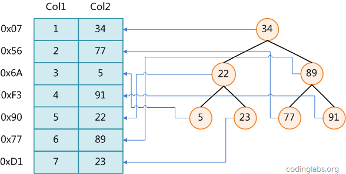

上图展示了一种可能的索引方式。左边是数据表，一共有两列七条记录，最左边的是数据记录的物理地址（注意逻辑上相邻的记录在磁盘上也并不是一定物理相邻的）。为了加快Col2的查找，可以维护一个右边所示的二叉查找树，每个节点分别包含索引键值和一个指向对应数据记录物理地址的指针，这样就可以运用二叉查找在的复杂度内获取到相应数据。

|               | Unsorted Array of rows | Sorted Array of rows | Tree of nodes                    |
| ------------- | ---------------------- | -------------------- | -------------------------------- |
| Pages contain | only data              | only data            | metadata, primary keys, and data |
| Rows per page | more                   | more                 | fewer                            |
| Insertion     | O(1)                   | O(n)                 | O(log(n))                        |
| Deletion      | O(n)                   | O(n)                 | O(log(n))                        |
| Lookup by id  | O(n)                   | O(log(n))            | O(log(n)                         |

目前大部分数据库系统及文件系统都采用B-Tree或其变种B+Tree作为索引结构，没有使用二叉查找树或其进化品种[红黑树](http://en.wikipedia.org/wiki/Red-black_tree)（red-black tree）的原因请参见这篇文章：http://www.cnblogs.com/serendipity-fly/p/9300360.html

###### 二、B树和B+树

维基百科对B树的定义为“在计算机科学中，B树（B-tree）是一种树状数据结构，它能够存储数据、对其进行排序并允许以O(log n)的时间复杂度运行进行查找、顺序读取、插入和删除的数据结构。B树，概括来说是一个节点可以拥有多于2个子节点的二叉查找树。与自平衡二叉查找树不同，B-树为系统最优化**大块数据的读和写操作**。B-tree算法减少定位记录时所经历的中间过程，从而加快存取速度。普遍运用在**数据库**和**文件系统**。”

**B树**

**B 树**可以看作是对2-3查找树的一种扩展，即他允许每个节点有M-1个子节点。

- 根节点至少有两个子节点；
- 每个节点有M-1个key，并且以升序排列；
- 位于M-1和M key的子节点的值位于M-1 和M key对应的Value之间；
- 其它节点至少有M/2个子节点；

下图是一个M=4 阶的B树：

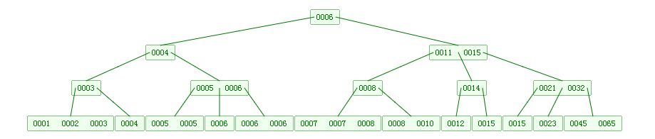

下面是往B树中依次插入

**6 10 4 14 5 11 15 3 2 12 1 7 8 8 6 3 6 21 5 15 15 6 32 23 45 65 7 8 6 5 4**

的演示动画：


**B+树**

**B+**树是对B树的一种变形树，它与B树的差异在于：

- 有k个子结点的结点必然有k个关键码；
- 非叶结点仅具有索引作用，跟记录有关的信息均存放在叶结点中。
- 树的所有叶结点构成一个有序链表，可以按照关键码排序的次序遍历全部记录。

如下图，是一个B+树：

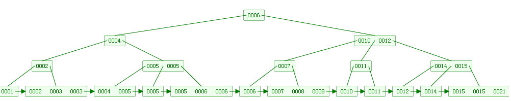

下面是往B+树中依次插入

**6 10 4 14 5 11 15 3 2 12 1 7 8 8 6 3 6 21 5 15 15 6 32 23 45 65 7 8 6 5 4**

的演示动画：


B和B+树的区别在于，B+树的非叶子结点只包含导航信息，不包含实际的值，所有的叶子结点和相连的节点使用链表相连，便于区间查找和遍历。

**B+ 树的优点在于：**

- 由于B+树在内部节点上不包含数据信息，因此在内存页中能够存放更多的key。 数据存放的更加紧密，具有更好的空间局部性。因此访问叶子节点上关联的数据也具有更好的缓存命中率。
- B+树的叶子结点都是相链的，因此对整棵树的便利只需要一次线性遍历叶子结点即可。而且由于数据顺序排列并且相连，所以便于区间查找和搜索。而B树则需要进行每一层的递归遍历。相邻的元素可能在内存中不相邻，所以缓存命中性没有B+树好。

但是B树也有优点，其优点在于，由于B树的每一个节点都包含key和value，因此经常访问的元素可能离根节点更近，因此访问也更迅速。下面是B 树和B+树的区别图：

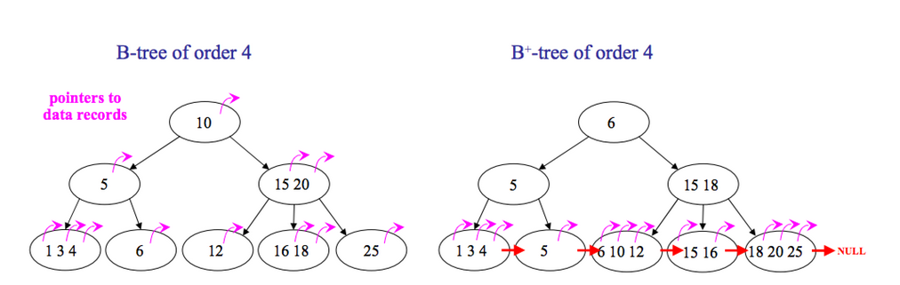

###### 三、MySQL的MyISAM索引和InnoDB索引

**MyISAM索引**

MyISAM引擎使用B+Tree作为索引结构，叶节点的data域存放的是数据记录的地址。下图是MyISAM索引的原理图：

.png)

这里设表一共有三列，假设我们以Col1为主键，则上图是一个MyISAM表的主索引（Primary key）示意。可以看出MyISAM的索引文件仅仅保存数据记录的地址。

**InnoDB索引**

虽然InnoDB也使用B+Tree作为索引结构，但具体实现方式却与MyISAM截然不同。

第一个重大区别是InnoDB的数据文件本身就是索引文件。从上文知道，MyISAM索引文件和数据文件是分离的，索引文件仅保存数据记录的地址。而在InnoDB中，表数据文件本身就是按B+Tree组织的一个索引结构，这棵树的叶节点data域保存了完整的数据记录。这个索引的key是数据表的主键，因此InnoDB表数据文件本身就是主索引。

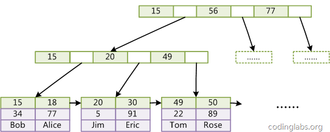


**本文将模拟InnoDB引擎：**

因B+数实现逻辑较复杂，下面代码是函数原型，完整代码请查看文末地址：

```c++
// 构造函数
bplus_tree(const char *path, bool force_empty = false);
/* abstract operations */
// 搜索
int search(const key_t& key, value_t *value) const;
// 范围搜索
int search_range(key_t *left, const key_t &right,
                 value_t *values, size_t max, bool *next = NULL) const;
// 删除
int remove(const key_t& key);
// 新增记录
int insert(const key_t& key, value_t value);
// 更新
int update(const key_t& key, value_t value);
```
###### 四、文件IO

B+tree的叶节点data域保存了完整的数据记录。我们需要将数据存入磁盘，构建相应的函数进行文件IO操作。下面是部分代码：

```c++
/* read block from disk */
template<class T>
int map(T *block, off_t offset) const
{
    return map(block, offset, sizeof(T));
}
/* write block to disk */
template<class T>
int unmap(T *block, off_t offset) const
{
    return unmap(block, offset, sizeof(T));
}
```

##### Step 6：完善CURD函数，初始化系统

以插入记录函数（C操作）为例：

```c++
// insert
int insertRecord(bplus_tree *treePtr,int *index, value_t *values){
	bpt::key_t key;
    //转换格式
	intToKeyT(&key,index);
	return (*treePtr).insert(key, *values);
}
```

函数参数分别为`bplus_tree *treePtr,int *index, value_t *values`，分别为B+树指针，索引指针，插入记录的参数指针。

再建立一个启动函数`initialSystem() ` 给 `main()` 调用：

```C++
// 创建一个B+树指针
bplus_tree *duck_db_ptr;
// initial
void initialSystem(){
	// step 1 : 打印帮助信息
	printHelpMess();
	// step 2 : 从文件初始化B+树，如果磁盘没有文件，将自动创建新的
	bplus_tree duck_db(dbFileName, (!is_file_exist(dbFileName)));
    // 传递地址给指针
	duck_db_ptr = &duck_db;
	// step 3 : 进入REPL SQL命令解析程序(insert,delete,update,search)
	selectCommand();
}
```

main函数

``` c++
int main(int argc, char *argv[])
{
    // 启动系统
	initialSystem();
}
```

#### 测试

使用[rspec](http://rspec.info/)测试duck_db，我们将插入5000条数据：

```ruby
it 'inserting test ' do
  script = (1..5000).map do |i|
    "insert db #{i} user#{i} #{i*12} person#{i}@example.com"
  end
  script << ".exit"
  result = run_script(script)
  expect(result.last(2)).to match_array([
    ">insert",
    "> bye!",
  ])
end
```

输入`bundle exec rspec`，结果如下：

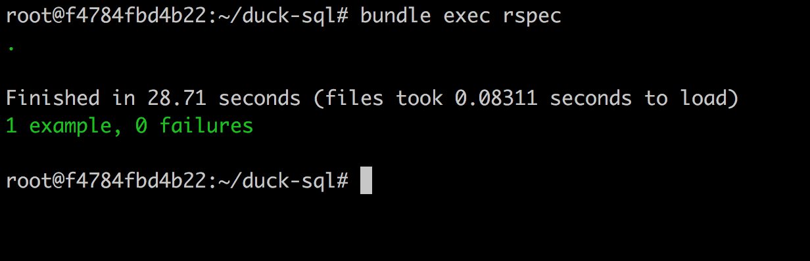

共耗时28.71秒，平均插入每条记录需要0.005742秒，并产生了5.1MB的数据文件：


随机查询一条数据：

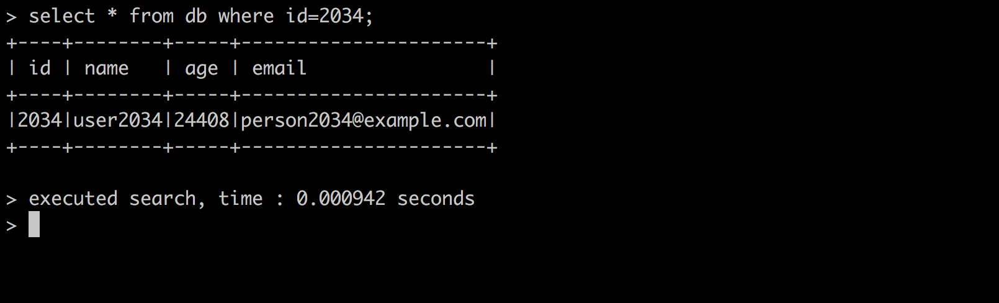


打印一个范围：

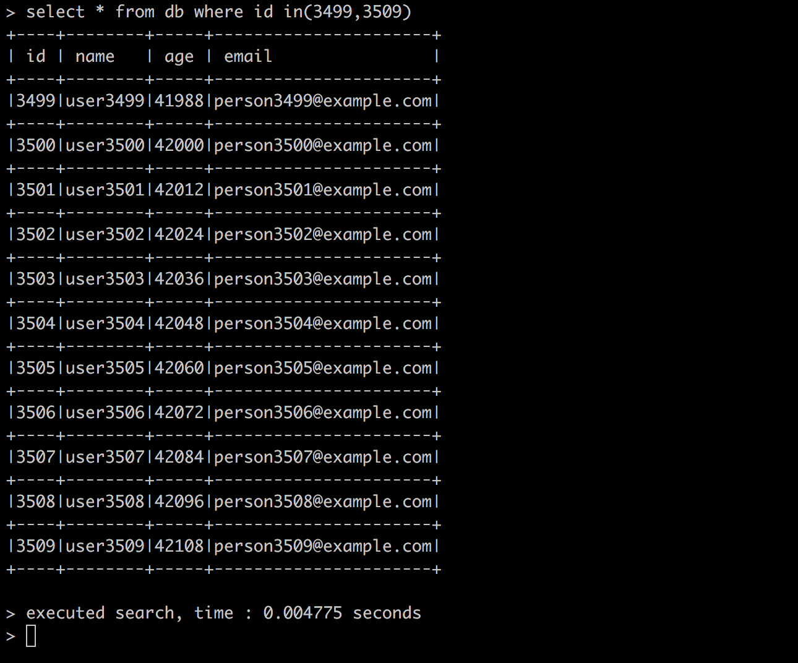

更新一条id=2634的记录：

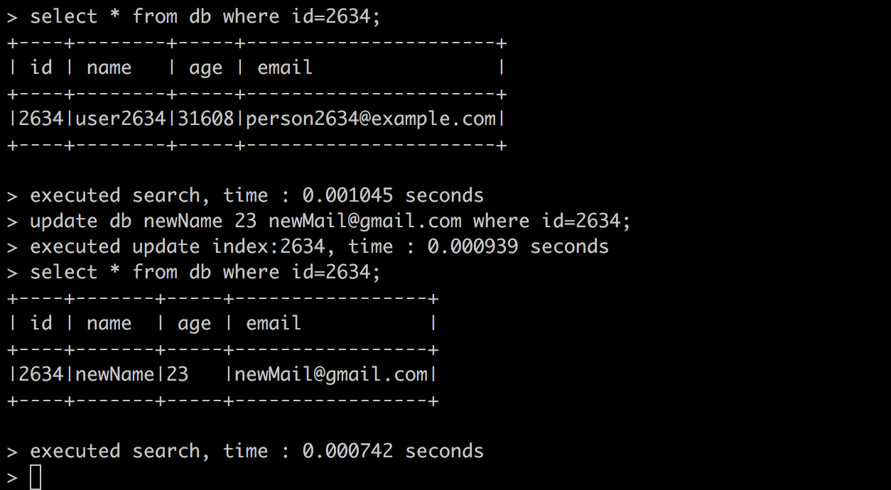

删除id=4265的记录：

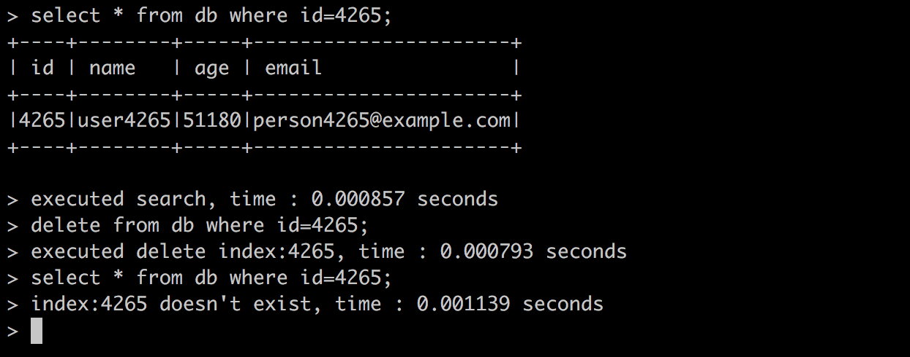

#### 评价

duck_db利用B+树实现了数据库基本的CURD操作，但是距离真实可用的数据库还有很大的差距，比如：

1. 无法创建自定义表；
2. 不支持事物处理，IO优化；
3. 不支持远程登录数据库，只可以本地使用；
4. CURD高级功能如函数，约束，连表操作等不支持；
5. 更多高级特性等。

#### 完整代码

项目代码已托管至GitHub：https://github.com/enpeizhao/duck_db

